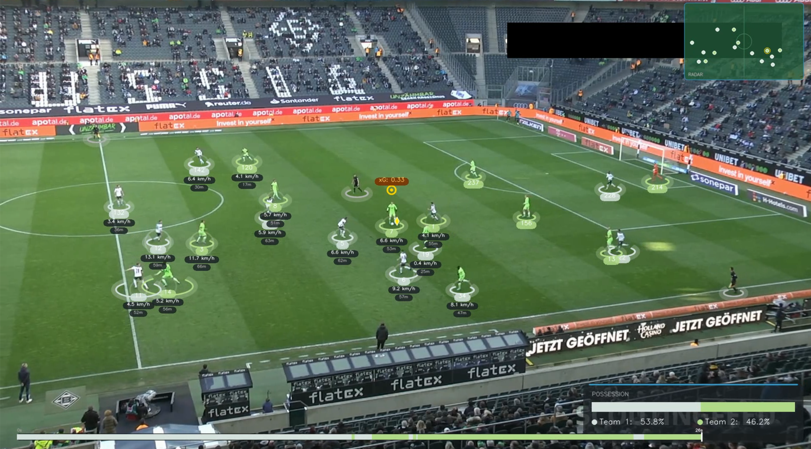
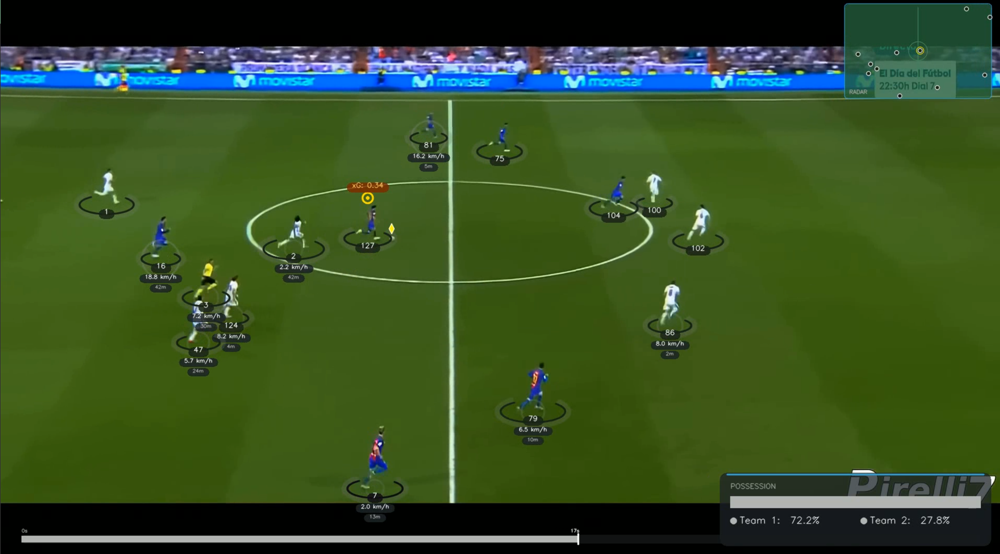

# FootCV

An end-to-end computer vision pipeline that transforms raw football match footage into fully annotated video with player tracking, team identification, ball possession, speed/distance metrics, expected goals (xG), pressing intensity analysis, a tactical minimap, and a possession timeline.





## Features

### Object Detection & Tracking
- **YOLOv5** custom-trained model detects players, referees, goalkeepers, and the ball
- **ByteTrack** multi-object tracker assigns persistent IDs across frames, handling occlusions
- Ball detection bypasses ByteTrack (always track ID 1) to avoid ID-switch issues with a fast, small object
- Batch inference (20 frames at a time) for efficiency

### Camera Movement Compensation
- **Lucas-Kanade sparse optical flow** tracks static stadium features (advertising boards, stands) to estimate camera pan/tilt
- Feature detection is **masked to top and bottom strips** of the frame — areas where no players appear — isolating true camera motion from player movement
- All tracked positions are adjusted by subtracting camera displacement, converting screen-space to a stabilized coordinate system

### Perspective Transform (Pixel to Real-World Meters)
- **Homographic perspective transform** maps pixel coordinates to real-world pitch positions
- Calibrated to a 23.32m x 68m pitch section using four reference points
- Points outside the calibrated quadrilateral are gracefully excluded via `cv2.pointPolygonTest`
- Enables all spatial analytics (speed, distance, xG, pressing) to operate in meters

### Team Assignment via Jersey Colors
A two-stage KMeans clustering approach:
1. **Per-player color extraction** — Crops the top half of each player's bounding box (jersey, not shorts), runs KMeans (k=2) to separate jersey pixels from background. Background cluster is identified by which cluster dominates the four corners of the crop
2. **Global team clustering** — Runs KMeans (k=2) on all extracted jersey colors to partition players into two teams

Results are cached per player ID for consistency across frames.

### Ball Possession Detection
- Measures distance from each player's **foot position** (bottom corners of bounding box) to the ball center
- Assigns possession to the nearest player within a 70-pixel threshold
- Team possession percentages are tracked cumulatively across all frames

### Speed & Distance Estimation
- Uses a **5-frame sliding window** at 24 FPS (~0.2 second intervals)
- Computes Euclidean distance between real-world positions at window start and end
- Converts to km/h and accumulates **total distance covered** per player
- Only operates on players with valid transformed positions

### Expected Goals (xG)
A logistic regression model estimating goal-scoring probability based on shot position:
- **Distance to goal**: Euclid
ean distance from player to goal center
- **Angle to goal**: Angle subtended by the goal posts (7.32m FIFA standard width) from the player's position — wider angle = better shooting opportunity
- **Logistic function**: `xG = 1 / (1 + exp(-(1.0 - 0.15 * distance + 3.0 * angle)))`
- Computed for all players every frame; displayed only for the ball holder when xG > 3%

### Pressing Intensity Analysis
Measures how aggressively the defending team is pressing the ball:
- Computes the **mean distance** of all defending players to the ball (in real-world meters)
- Classification:
  - **HIGH** (< 8m) — Intense press, defenders swarming the ball
  - **MED** (8-15m) — Moderate pressing
  - **LOW** (> 15m) — Deep block, no active press

### Ball Position Interpolation
- Uses **pandas linear interpolation** followed by backfill to estimate ball position in frames where detection failed
- Ensures smooth ball tracking even when the ball is temporarily occluded or too small to detect

## Visual Output

The annotated video includes:

| Element | Description |
|---|---|
| **Player Markers** | Team-colored ellipses at foot level with glow effects and track ID badges |
| **Ball Marker** | Cyan diamond marker above the ball |
| **Possession Indicator** | Pulsing ring animation above the player with the ball |
| **Speed Halos** | Translucent circles around players, radius scales with speed (shown above 2 km/h) |
| **Speed/Distance Badges** | Per-player pill badges showing current speed (km/h) and cumulative distance (m) |
| **xG Badge** | Navy pill badge showing expected goals value for the ball holder |
| **Possession Panel** | Bottom-right HUD showing cumulative team possession % with colored progress bar |
| **Pressing Panel** | Top-left HUD showing pressing intensity (HIGH/MED/LOW) with color-coded indicator |
| **Camera Info** | Top-left panel showing camera movement vectors when displacement > 0.5px |
| **Tactical Minimap** | Top-right radar view showing all player positions on a scaled pitch diagram |
| **Possession Timeline** | Bottom bar showing last 30 seconds of possession as a color-coded timeline |

## Architecture

```
main.py
├── read_video                          # Load all frames
├── Tracker (YOLO + ByteTrack)          # Detect & track objects
│   └── add_position_to_tracks          # Foot position (players) / center (ball)
├── CameraMovementEstimator             # Optical flow on stadium features
│   └── add_adjust_positions_to_tracks  # Subtract camera displacement
├── ViewTransformer                     # Perspective warp to meters on pitch
├── interpolate_ball_positions          # Fill missing ball detections
├── SpeedAndDistance_Estimator          # Sliding window speed + cumulative distance
├── XGEstimator                         # Logistic xG model
├── TeamAssigner                        # Two-stage KMeans jersey clustering
├── PlayerBallAssigner                  # Nearest-foot ball possession
├── PressingEstimator                   # Defending team avg distance to ball
├── draw_annotations                    # visual_engine renders everything
│   ├── player_renderer                 # Player/ball/possession/speed/xG overlays
│   ├── hud_renderer                    # Possession panel, pressing panel, camera info
│   ├── minimap_renderer                # Top-down radar minimap
│   └── timeline_renderer              # Possession timeline bar
└── save_video                          # Write XVID AVI at 24 FPS
```

### Central Data Structure

All modules communicate through a shared `tracks` dictionary:

```python
tracks[object_type][frame_number][track_id] = {
    "bbox": [x1, y1, x2, y2],              # Tracker
    "position": (x, y),                     # Foot position (players) or center (ball)
    "position_adjusted": (x, y),            # Camera-movement compensated
    "position_transformed": (x, y) | None,  # Real-world meters (None if off-pitch)
    "speed": float,                         # km/h
    "distance": float,                      # Cumulative meters
    "xg": float,                            # Expected goals probability
    "team": 1 | 2,                          # Team assignment
    "team_color": (B, G, R),                # BGR team color
    "has_ball": bool,                       # Ball possession flag
}
```

### Stub Caching System

The two most expensive operations (YOLO tracking and optical flow) are cached as pickle files with **video-specific filenames**:

```
stubs/08fd33_4_track_stubs.pkl
stubs/08fd33_4_camera_movement.pkl
```

Set `read_from_stub=True` in `main.py` to skip recomputation. Stubs are automatically scoped per input video, so switching videos won't overwrite existing caches.

## Setup

### Prerequisites

1. Python 3.8+
2. Download the [trained YOLOv5 model](https://drive.google.com/file/d/1DC2kCygbBWUKheQ_9cFziCsYVSRw6axK/view?usp=sharing) into `models/best.pt`
3. Download the [sample input video](https://drive.google.com/file/d/1t6agoqggZKx6thamUuPAIdN_1zR9v9S_/view?usp=sharing) into `input_videos/08fd33_4.mp4`

### Install Dependencies

```bash
pip install ultralytics supervision opencv-python numpy pandas scikit-learn matplotlib
```

### Run

```bash
python main.py
```

Change the input video by editing the `INPUT_VIDEO` variable at the top of `main.py`. On first run with a new video, stubs will be automatically generated. Subsequent runs with the same video will load from cache.

Output is saved to `output_videos/output_video.avi`.

## Project Structure

```
football_analysis/
├── main.py                          # Pipeline orchestrator
├── models/best.pt                   # Trained YOLOv5 weights
├── input_videos/                    # Source match footage
├── output_videos/                   # Annotated output
├── stubs/                           # Cached computation results
├── trackers/                        # YOLO detection + ByteTrack tracking
├── camera_movement_estimator/       # Optical flow camera compensation
├── view_transformer/                # Perspective transform (px to meters)
├── speed_and_distance_estimator/    # Player speed and distance metrics
├── xg_estimator/                    # Expected goals model
├── pressing_estimator/              # Pressing intensity analysis
├── team_assigner/                   # Jersey color team classification
├── player_ball_assigner/            # Ball possession assignment
├── visual_engine/                   # Annotation rendering engine
│   ├── theme.py                     # Color palette and design constants
│   ├── primitives.py                # Rounded rects, glows, pill badges
│   ├── player_renderer.py           # Per-player visual overlays
│   ├── hud_renderer.py              # HUD panels (possession, pressing, camera)
│   ├── minimap_renderer.py          # Top-down tactical radar
│   └── timeline_renderer.py         # Possession timeline bar
├── utils/                           # Shared utilities (bbox, video I/O)
├── training/                        # YOLOv5 training notebook
└── development_and_analysis/        # R&D notebooks
```

## Key Design Decisions

- **Foot position as spatial anchor**: Player positions use the bottom-center of the bounding box (feet), not the body center. This eliminates height-dependent parallax errors in ground-plane spatial analysis.
- **Masked optical flow**: Feature detection is restricted to stadium bands (top/bottom of frame) where no players appear, preventing player movement from being misinterpreted as camera motion.
- **Ball bypasses ByteTrack**: The ball is too small and fast for reliable multi-object tracking. Instead, raw detections are used directly with linear interpolation filling gaps.
- **Per-video stub caching**: Expensive computations are pickled with video-specific filenames, enabling rapid iteration on downstream modules without re-running detection.
- **xG computed for all players**: Though only displayed for the ball holder, xG is calculated for every player at every frame, enabling potential future features like off-ball threat analysis.
